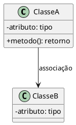
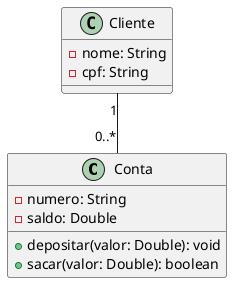
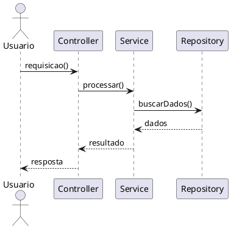
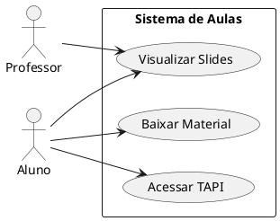
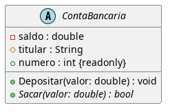

# Especificação de Assets e Recursos

## Visão Geral

Esta especificação define os padrões para assets (imagens, diagramas, ícones) e recursos utilizados no projeto Aulas.

## Estrutura de Diretórios

```
assets/
├── uml/                        # Diagramas UML
│   ├── Agregacao.puml
│   ├── Associacao.puml
│   ├── Composicao.puml
│   └── ContaBancaria.puml
│
├── img/                        # Imagens gerais (opcional)
│   ├── logos/
│   ├── icons/
│   └── screenshots/
│
└── diagrams/                   # Outros diagramas (opcional)
    ├── arquitetura/
    └── fluxos/
```

## Diagramas UML (PlantUML)

### Localização

Todos os arquivos PlantUML devem estar em `assets/uml/`.

### Convenção de Nomenclatura

| Padrão | Exemplo | Descrição |
|--------|---------|-----------|
| `<TipoRelacao>.puml` | `Agregacao.puml` | Diagrama de tipo de relação |
| `<Entidade>.puml` | `ContaBancaria.puml` | Diagrama de entidade específica |
| `<Modulo>_<Tema>.puml` | `Mod5_Valuation.puml` | Diagrama específico do módulo |

### Estrutura de Arquivo PlantUML



### Tipos de Diagramas Suportados

#### 1. Diagrama de Classes



#### 2. Diagrama de Sequência



#### 3. Diagrama de Casos de Uso



#### 4. Diagrama de Atividades

```plantuml
@startuml
start
:Iniciar aula;
:Apresentar objetivos;
if (Pré-requisitos ok?) then
  yes
  :Continuar conteúdo;
  :Atividade prática;
else
  no
  :Revisar conceitos;
endif
:Encerrar aula;
stop
@enduml
```

### Renderização de PlantUML

#### Opção 1: Usar Plugin VS Code

Instale a extensão "PlantUML" e visualize com `Alt+D`.

#### Opção: Exportar para PNG

```bash
# Usando plantuml.jar
java -jar plantuml.jar assets/uml/*.puml

# Output: assets/uml/*.png
```

#### Opção: Usar Servidor Online

```
https://www.plantuml.com/plantuml/uml/<CODIGO_BASE64>
```

### Inclusão de Diagramas em HTML

```html
<!-- Como imagem PNG -->


<!-- Ou usar renderização online -->

```

## Imagens

### Formatos Suportados

| Formato | Uso | Tamanho Máximo |
|---------|-----|----------------|
| PNG | Diagramas, screenshots | 500 KB |
| SVG | Ícones, logos | 50 KB |
| JPG | Fotos | 300 KB |
| WEBP | Imagens otimizadas | 200 KB |

### Convenção de Nomenclatura

| Padrão | Exemplo | Descrição |
|--------|---------|-----------|
| `<modulo>-<tema>.png` | `mod5-excel-screenshot.png` | Screenshot específica |
| `<tipo>-<nome>.svg` | `icon-download.svg` | Ícone |
| `diagrama-<tema>.png` | `diagrama-arquitetura.png` | Diagrama renderizado |

### Localização

```
assets/
├── img/
│   ├── logos/
│   │   └── inteli-logo.png
│   ├── icons/
│   │   ├── download.svg
│   │   └── slides.svg
│   └── screenshots/
│       └── module-5/
│           └── excel-tela.png
```

### Estilos para Imagens

```css
/* Imagem responsiva */
.img-fluid {
  max-width: 100%;
  height: auto;
}

/* Imagem com borda arredondada */
.img-rounded {
  border-radius: 12px;
}

/* Imagem com sombra */
.img-shadow {
  box-shadow: 0 4px 15px rgba(0,0,0,0.1);
}

/* Imagem centralizada */
.img-center {
  display: block;
  margin: 0 auto;
}
```

### Uso em HTML

```html
<figure class="text-center my-4">
  
  <figcaption class="mt-2 text-muted">
    Figura 1: Calculando VPL no Excel
  </figcaption>
</figure>
```

## Ícones

### Emojis (Recomendado)

O projeto utiliza emojis extensivamente para:

- Tags de tópicos em slides
- Ícones de navegação
- Destaques em listas

| Emoji | Uso | Exemplo |
|-------|-----|---------|
| 📊 | Dados/Gráficos | Análise de dados |
| 📈 | Crescimento | Séries temporais |
| 💰 | Finanças | Valuation, VPL |
| 💻 | Computação | Código, planilhas |
| 🐍 | Python | Scripts Python |
| 🔄 | Processos | ETL, fluxos |
| 🏗️ | Arquitetura | Estrutura de dados |
| 📖 | Leitura | Material escrito |
| 🎞️ | Slides | Apresentação |
| 📚 | Estudo | Autoestudo |
| 🚀 | Início | Launch, setup |
| 🦊 | GitLab | Tutorial GitLab |
| 👨‍🏫 | Professor | Sobre o professor |

### Ícones SVG Customizados

Para ícones não disponíveis como emojis:

```html
<!-- Ícone inline SVG -->
<svg width="24" height="24" viewBox="0 0 24 24" fill="none" 
     xmlns="http://www.w3.org/2000/svg">
  <path d="M12 4V20M4 12H20" stroke="currentColor" 
        stroke-width="2" stroke-linecap="round"/>
</svg>
```

### Bootstrap Icons (Opcional)

```html
<!-- Adicionar no head -->
<link rel="stylesheet" 
      href="https://cdn.jsdelivr.net/npm/bootstrap-icons@1.11.0/font/bootstrap-icons.css">

<!-- Usar ícone -->
<i class="bi bi-download"></i> Download
```

## Logotipo Inteli

### URL Oficial (CDN)

```
https://res.cloudinary.com/dyhjjms8y/image/upload/v1769427095/9c2796bb-d4da-4f4e-846a-d38d547249ee_pwwh3l.png
```

### Uso em Slides (Capa)

```html

```

### Uso em Header de Página

```html

```

## Favicon

### Padrão do Projeto

SVG inline com emoji de livro:

```html
<link rel="icon"
  href="data:image/svg+xml,<svg xmlns=%22http://www.w3.org/2000/svg%22 viewBox=%220 0 100 100%22><text y=%22.9em%22 font-size=%2290%22>📚</text></svg>">
```

### Variação por Módulo

```html
<!-- Módulo 5 Adm Tech (gráficos) -->
<link rel="icon"
  href="data:image/svg+xml,<svg xmlns=%22http://www.w3.org/2000/svg%22 viewBox=%220 0 100 100%22><text y=%22.9em%22 font-size=%2290%22>📊</text></svg>">

<!-- Módulo Python -->
<link rel="icon"
  href="data:image/svg+xml,<svg xmlns=%22http://www.w3.org/2000/svg%22 viewBox=%220 0 100 100%22><text y=%22.9em%22 font-size=%2290%22>🐍</text></svg>">

<!-- Módulo Finanças -->
<link rel="icon"
  href="data:image/svg+xml,<svg xmlns=%22http://www.w3.org/2000/svg%22 viewBox=%220 0 100 100%22><text y=%22.9em%22 font-size=%2290%22>💰</text></svg>">
```

## Código e Snippets

### Blocos de Código em HTML

```html
<div class="code-block">
  <pre><code>import pandas as pd

# Carregar dados
df = pd.read_csv('dados.csv')

# Calcular média
media = df['valor'].mean()
print(f"Média: {media}")</code></pre>
</div>
```

### Estilos para Código

```css
.code-block {
  background: #1e1e2e;
  color: #f8f8f2 !important;
  padding: 20px;
  border-radius: 12px;
  font-family: 'Space Mono', monospace;
  font-size: 0.85rem;
  margin: 10px 0;
  overflow-x: auto;
  line-height: 1.6;
}

.code-block pre {
  margin: 0;
  white-space: pre;
}
```

### Syntax Highlighting (Opcional)

Para highlight de sintaxe, use Prism.js ou Highlight.js:

```html
<!-- Prism.js -->
<link href="https://cdnjs.cloudflare.com/ajax/libs/prism/1.29.0/prism.min.css" rel="stylesheet">
<script src="https://cdnjs.cloudflare.com/ajax/libs/prism/1.29.0/prism.min.js"></script>
<script src="https://cdnjs.cloudflare.com/ajax/libs/prism/1.29.0/components/prism-python.min.js"></script>

<!-- Uso -->
<pre><code class="language-python">import pandas as pd</code></pre>
```

## Notebooks Jupyter

### Estrutura

Notebooks podem ser incluídos no repositório:

```
pages/module-5-adm-tech/
├── lesson-3.ipynb
├── lesson-3-requirements.txt
└── ...
```

### Requisitos

- Incluir `requirements.txt` com dependências
- Notebook deve ser executável do início ao fim
- Outputs devem estar limpos (clear output antes de commitar)

### Link para Colab

```html
<a href="https://colab.research.google.com/github/usuario/repo/blob/main/notebook.ipynb" 
   target="_blank" 
   class="btn btn-success">
  🚀 Abrir no Google Colab
</a>
```

## Checklist de Validação de Assets

### Imagens

- [ ] Formato adequado (PNG/SVG/JPG/WEBP)
- [ ] Tamanho otimizado (< 500 KB)
- [ ] Alt text descritivo
- [ ] Responsiva (max-width: 100%)
- [ ] Legenda quando necessário

### Diagramas UML

- [ ] Arquivo .puml em `assets/uml/`
- [ ] Nome seguindo convenção
- [ ] Sintaxe PlantUML válida
- [ ] Versão PNG gerada (opcional)
- [ ] Referenciado corretamente no HTML

### Ícones

- [ ] Emoji preferencialmente
- [ ] SVG inline se necessário
- [ ] Tamanho consistente
- [ ] Contraste adequado

### Código

- [ ] Formatado em bloco próprio
- [ ] Fonte monospace
- [ ] Scroll horizontal se longo
- [ ] Syntax highlighting (opcional)

## Recursos Externos

### CDNs Utilizadas

| Recurso | URL | Versão |
|---------|-----|--------|
| Bootstrap CSS | `cdn.jsdelivr.net/npm/bootstrap` | 5.3.0 |
| Google Fonts | `fonts.googleapis.com` | - |
| Prism.js | `cdnjs.cloudflare.com/ajax/libs/prism` | 1.29.0 |

### Fontes

```html
<!-- Manrope (principal) -->
<link href="https://fonts.googleapis.com/css2?family=Manrope:wght@400;500;600;700;800&display=swap" rel="stylesheet">

<!-- Space Mono (código) -->
<link href="https://fonts.googleapis.com/css2?family=Space+Mono:wght@400;700&display=swap" rel="stylesheet">
```
